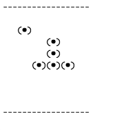

Game of Life
------------------
An implementation of Conway's Game of Life, with animation in the terminal.

To run in a terminal program:

1. Install [leiningen](https://github.com/technomancy/leiningen).
2. `git clone git@github.com:richardharrington/game-of-life.git`
3. `cd game-of-life`
4. `lein repl`
5. `(play <width> <height> <milliseconds-per-round>)`
6. Press `Ctrl-d` to stop, and adjust the height and width of your terminal window.
7. Repeat steps 5 and 6 until the dotted line in the window is just below the top of the window, and does not wrap around to more than one line.
8. Boom, animation!
9. (optional) To start with the pattern above: `(play <width> <height> <milliseconds-per-round> live-cells-test-grid)`

